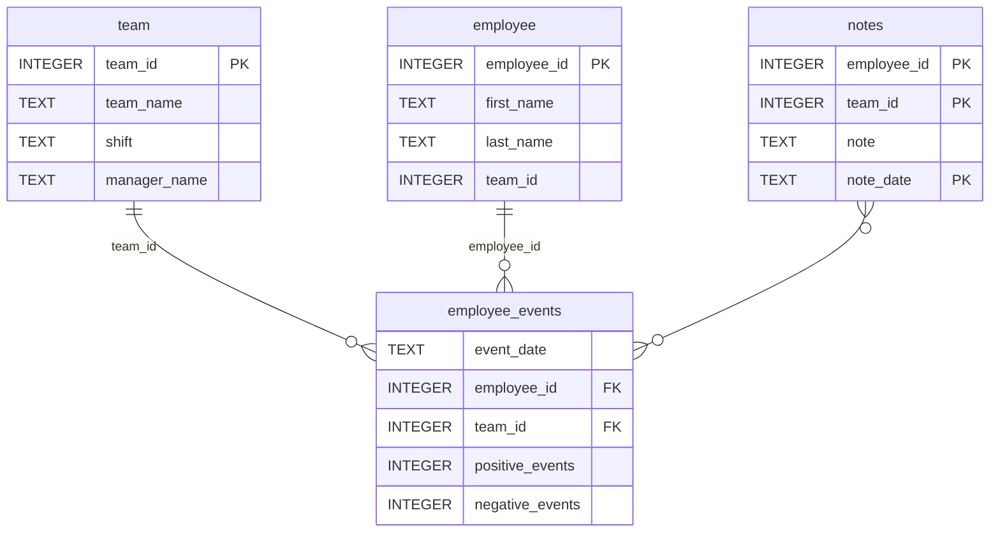

## 🧭 DSND Employee Event Dashboard

An interactive Employee and Team Event Dashboard built with FastHTML, Uvicorn, Matplotlib, and Pandas for the Data Science Nanodegree (DSND) program.

This project demonstrates data engineering, SQL integration, and Python web application design — visualizing employee performance data, event metrics, and retention risk predictions.

## 🚀 Features
### 🎛 Interactive Controls

Profile Type Selector: Switch between Employee and Team views using radio buttons.

Dynamic Dropdown: Automatically updates available names based on selected profile type.

Submit Button: Refreshes the dashboard with data for the selected entity.

### 📊 Data Visualizations

Cumulative Events Line Chart
Displays positive and negative events over time using Matplotlib.
Data is aggregated per day and plotted as cumulative totals.

Recruitment Risk Bar Chart
Uses a pre-trained ML model (load_model() utility) to visualize predicted recruitment risk probability.

### 🧾 Notes Table

Displays notes related to the selected employee or team, including the note text and date.
Data is retrieved dynamically from the SQLite database and presented in a FastHTML data table.

## Repository Structure
```
├── README.md
├── assets
│   ├── model.pkl
│   └── report.css
├── env
├── python-package
│   ├── employee_events
│   │   ├── __init__.py
│   │   ├── employee.py
│   │   ├── employee_events.db
│   │   ├── query_base.py
│   │   ├── sql_execution.py
│   │   └── team.py
│   ├── requirements.txt
│   ├── setup.py
├── report
│   ├── base_components
│   │   ├── __init__.py
│   │   ├── base_component.py
│   │   ├── data_table.py
│   │   ├── dropdown.py
│   │   ├── matplotlib_viz.py
│   │   └── radio.py
│   ├── combined_components
│   │   ├── __init__.py
│   │   ├── combined_component.py
│   │   └── form_group.py
│   ├── dashboard.py
│   └── utils.py
├── requirements.txt
├── start
├── tests
    └── test_employee_events.py
```

### employee_events.db


## ⚙️ Installation & Setup

### 1️⃣ Clone the Repository

```bash
git clone https://github.com/mgo-1234/dsnd-dashboard-project.git
cd dsnd-dashboard-project
```

### 2️⃣ Create and Activate Virtual Environment

```bash
python -m venv .venv
source .venv/bin/activate   # On macOS/Linux
# or
.venv\Scripts\activate      # On Windows
```

### 3️⃣ Install Dependencies

```bash
pip install -e ./python-package
pip install -r requirements.txt
```

### 4️⃣ Run the Application

```bash
python -m uvicorn report.dashboard:app --host 0.0.0.0 --port 8000 --reload
```

Then open your browser at:
👉 **[http://localhost:8000](http://localhost:8000)** (or the Codespace preview link if using GitHub Codespaces)

---

## 🧠 Technology Stack

| Component      | Description                                                   |
| -------------- | ------------------------------------------------------------- |
| **FastHTML**   | Web framework used for component-based HTML rendering         |
| **Uvicorn**    | ASGI server for running FastHTML applications                 |
| **Matplotlib** | Data visualization library for generating line and bar charts |
| **Pandas**     | Data manipulation and transformation                          |
| **SQLite**     | Local relational database for employee and event data         |
| **NumPy**      | Support library for data structures used in ML and analytics  |

---

## 🧩 Core Python Classes

| File                            | Key Class                                      | Responsibility                                           |
| ------------------------------- | ---------------------------------------------- | -------------------------------------------------------- |
| `employee_events/employee.py`   | `Employee`                                     | Handles SQL queries for individual employee data         |
| `employee_events/team.py`       | `Team`                                         | Handles SQL queries for team-level aggregation           |
| `employee_events/query_base.py` | `QueryBase`                                    | Inherits from `QueryMixin` for shared SQL operations     |
| `report/dashboard.py`           | `Report`, `Visualizations`, `NotesTable`, etc. | FastHTML components composing the UI                     |
| `report/utils.py`               | `load_model()`                                 | Loads pre-trained machine learning model for predictions |

---

## 📈 Example Dashboard Output

When the app is running, selecting an **Employee** like *Taylor Bennett* displays:

* A **line chart** of cumulative positive and negative events,
* A **bar chart** showing predicted recruitment risk,
* A **table** of notes for that employee.

Example snapshot:


---

## 🧾 References & Citations

This project was completed using:

Udacity. Data Science Nanodegree Program – Employee Event Dashboard Project. (2024).

Hunter, J. D. (2007). Matplotlib: A 2D Graphics Environment. Computing in Science & Engineering, 9(3), 90–95.
https://matplotlib.org/

McKinney, W. (2010). Data Structures for Statistical Computing in Python. Proceedings of the 9th Python in Science Conference, 51–56.
https://pandas.pydata.org/

Harris, C. R. et al. (2020). Array programming with NumPy. Nature, 585, 357–362.
https://numpy.org/

FastHTML Framework. (2024). Lightweight Python Web Framework.
https://github.com/AnswerDotAI/FastHTML

Uvicorn. (2024). ASGI Web Server for Python.
https://www.uvicorn.org/

SQLite. SQL Language Reference.
https://www.sqlite.org/docs.html

OpenAI. (2025). ChatGPT (GPT-5) – Conversational AI used for debugging and documentation assistance.
https://chat.openai.com/

---

## 🧪 Validation

✅ **Tested Environment**

* Python 3.12
* Uvicorn 0.30+
* FastHTML latest compatible release
* GitHub Codespaces Linux VM

✅ **Functional Checks**

* Employee and Team dropdowns work dynamically.
* Visualizations render without errors.
* NotesTable correctly displays SQL data.
* Model predictions and event aggregation verified.

---

© 2025 Mgo-1234. Developed as part of the Udacity Data Science Nanodegree Program.

